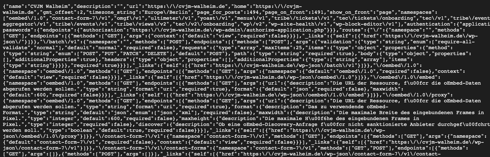
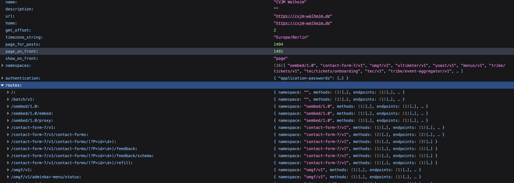
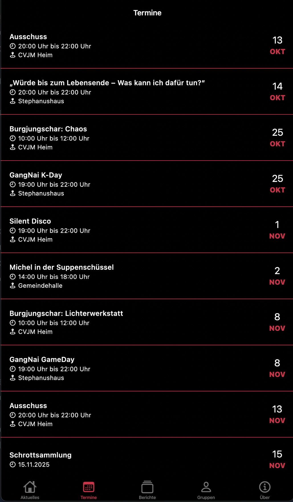
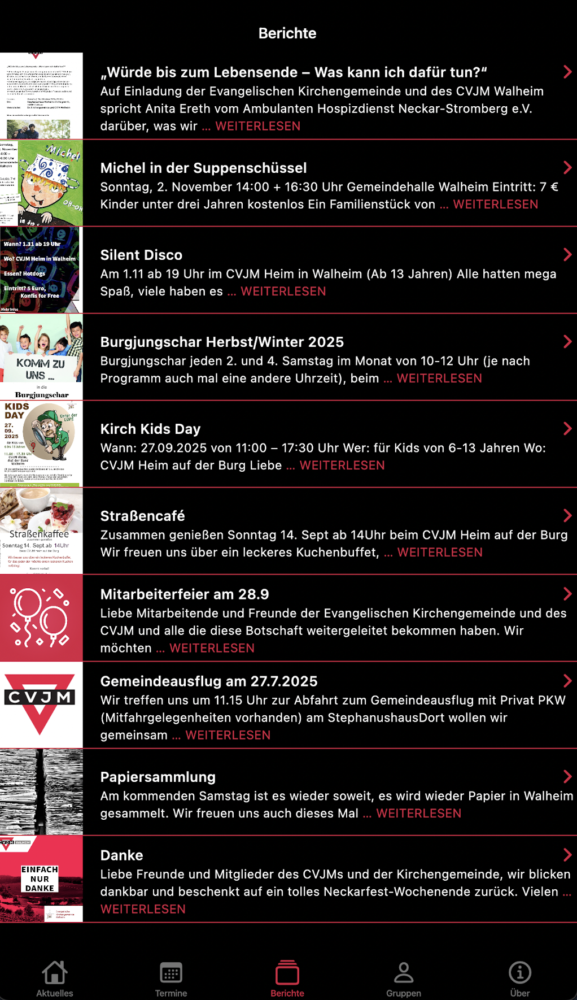
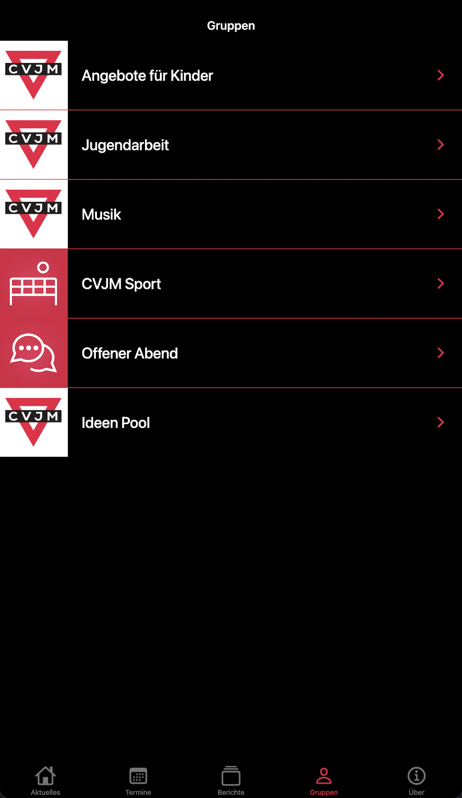
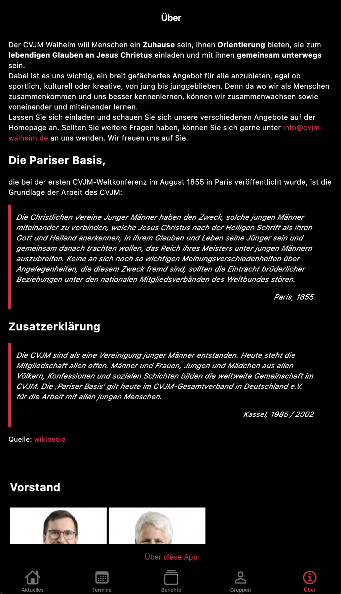

+++
date = '2025-10-11'
draft = false
tags = ['Flutter', 'Wordpress']
title = 'Flutter meets Wordpress am Beispiel CVJM Walheim App'
categories = ['Blog']
+++

## Warum habe ich diese App geschrieben? 

Das hatte sicherlich mehrere Gründe. Unter anderem hatte ich schlicht einfach mal Lust eine App zu schreiben. Ich dachte das muss doch sicherlich ein cooles Gefühl sein zu wissen, dass man etwas geschrieben und bereitgestellt hat, dass jetzt hunderte und tausende Nutzer einfach runter laden und verwenden können. (Spoiler: Meine App Idee ist durch ihre lokale Datenlage aber nie "abgehoben" und das ist auch okay). Dann hatte ich in dieser Lebensphase auch einfach die Zeit dafür. Es waren noch die Covid Ausläufe, das Leben war langsamer und irgendwie musste man die Zeit ja rum bringen. 

Einfach so eine App schreiben kam für mich aber nicht in Frage, ich wollte schon etwas programmieren, dass zumindest ein wenig den Anschein von etwas Sinnvollem erweckt. Gut, dass ich ein wenig vorher Vorstand vom lokalen CVJM wurde. Hier hatte ich die komplette Homepage ersteinmal auf links gedreht. Nicht, dass ich die Arbeiten des vorherigen Admin kleinreden will, aber mir hatte die Seite nicht so zugesagt und nachdem mir mitgeteilt wurde, dass die Seite eigentlich keine aktive Pflege mehr erhält, ging ich ans Werk. Es wurden online Kalender angelegt, ein Buchungssystem eingerichtet für das Vereinsheim, Newsletter und was man sonst noch mit Wordpress Plugins so alles treiben kann. 

Immer den Spruch von Apple im Kopf "There is an app for that" dachte ich, eigentlich braucht die neue Seite nun auch eine App. Und so ging ich auf die Reise. 

## Woher und wie wollte ich die Daten abholen? 

Immer wieder dachte ich, es muss doch einen Weg geben die App mit Daten aus der Homepage befüllen zu können. Dabei bin ich davon ausgegangen, dass ich hierfür einen Dienst, oder irgend einen speziellen Endpunkt brauchen würde den Wordpress so nicht liefern würde. Bei meiner Suche im WWW fand ich dann ein Repo mit einer ganz einfach Implementierung meiner Idee (leider weiß ich nicht mehr welche App das war, vielleicht gehe ich mal auf die Suche). Eine single Page Applikation. Nur die Posts von der Seite das wars. Keine weiteren Features. Okay, dachte ich, das ist ein guter Start, damit kann man was anfangen. 

Bei der Sichtung des Codes stellte ich fest, dass ganz schlicht und einfach die API von Wordpress verwendet wurde. Hängt man hinter die Startseite `/wp-json/` so kommt man ganz einfach an alle Endpunkte und kann sich schon mit der Basisinstallation von Wordpress die Posts ziehen. Da sollte ich aber nicht stehen bleiben. Doch eins nach dem anderen.

Ersteinmal muss gesagt werden, wer wie ich zum ersten mal in die Webentwickler Welt abtaucht (ich bin PLC Programmierer) und Safari benutzt der wird sich mit so was konfrontiert sehen (siehe Bild Safari). Nicht gerade schön und nicht gerade hilfreich. 

Zum Glück ist Appels Browser aber nicht der einzige auf dieser Welt. Ruft man zum Beispiel diesen [Endpoint](https://cvjm-walheim.de/wp-json") in Firefox auf, dann bekommt man eine schöne Darstellung der einzelnen Json Daten, so dass man auch ordentlich damit arbeiten kann. Das ist sicherlich für den ein oder anderen super trivial, aber wie gesagt, das ist eben nicht meine Domäne und deshalb fand ich es an dieser Stelle einfach mal wichtig erwähnt zu haben. 

## Was soll die App machen?

Da mein Einstieg in die Flutter Welt das oben genannte Repo war. War klar, die Posts müssen auf jeden Fall geladen werden können. Ohne Daten macht es ja auch keinen Sinn eine App zu haben. Weiter war es mir wichtig den Mitgliedern des Vereins auch zu zeigen wann welche Termine anstehen. Nicht jeder weiß wie man einen ICal Kalender einrichten kann, die meisten wissen aber wie man eine App installiert. Immer in der Hoffnung, dass ich die App auch so programmiere, dass jeder die App verwenden kann. Als diese beiden Funktionen implementiert wurden, ging ich noch einen Schritt weiter und habe auf der Wordpressseite ein zusätzliches Plugin installiert. Diese Plugin ermöglichte es mir nun die Menüs über die Rest-API abzurufen. Jetzt konnte ich auch noch die Menüs auslesen. So, dass ich jetzt auch die verschiedenen Gruppen und Kreise in der App anzeigen konnte. Für die Darstellung der einzelnen Gruppen und Kreisen nehme ich mir einfach die raw HTML welche ich über den Endpunkt bekomme und rendere mir diese dann in die App. 

Eine vollständige Liste aller Funktionen der CVJM Walheim App findet ihr im Repo auf [Github](https://github.com/HugeGo88/cjvm_app).

## Das Ergebnis (oder der Zwischenstand)

Schlussendlich ist die App gerade eine nette Applikation mit einer Tab-Bar unten, mithilfe dieser kann man die unterschiedlichen Seiten aufrufen. Nichts weltbewegendes, aber cool, weil ich eben die Daten einmal in Wordpress einpflege und jeder mithilfe der App diese Daten einfach einsehen kann. 

Hier mal ein paar Bilder. 

## Ausblick

Gerne würde ich irgendwann mal Zeit finden hier noch eine Kalenderansicht hinzuzufügen, oder einen Kategorie filter. Auch Notifications und Push mitteilungen fände ich super interessant. Aber leider fehlt mir hierfür die Zeit. Aber wer weiß vielleicht komme ich ja irgendwann mal dazu. 

## Github

[Hier](https://github.com/HugeGo88/cjvm_app) findest du den gesamten Quellcode der App. Mit ein paar Anpassungen sollte es möglich sein die App auch an deine Wordpress-Seite anzupassen. Eigentlich wollte ich immer mal eine App schreiben die man mit wenig Konfigurationsaufwand an seine Seite anpassen kann. Leider bin ich rein zeitlich nie ganz dazu bekommen. Aber [hier](https://github.com/HugeGo88/wordpress_widget) ist mal der Grundstein dafür gelegt. 