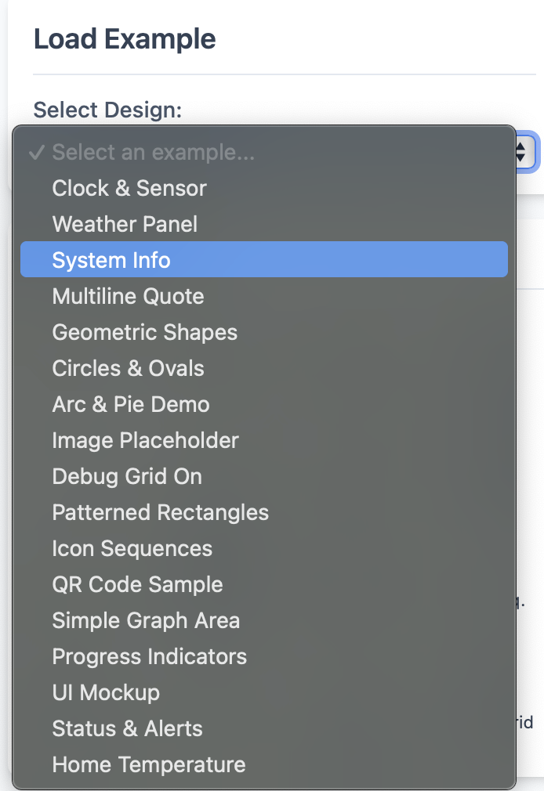

+++
date = '2025-10-25'
draft = true
tags = ['Home Assistant', 'Anleitung', 'OpenEpaperLink', 'HA YAML Designer', 'Epaper', 'Price tag']
title = 'OpenEpaperLink HA YAML Designer'
categories = ['Blog']
+++


## Einleitung

Immer mehr Supermärkte haben mittlerweile Epaper Pricetags in den Regalen hängen. Nicht nur, dass man diese Preisschilder mehr und mehr sieht, nein sie werden auch größer, gefühlt scharfer und auch Farben können mittlerweile gut dargestellt werden. 

Ich finde diese Displays einfach faszinierend. Sie brauchen nur beim Bildupdate Strom und können somit mit ein paar kleinen Knopfzellen betrieben werden und das über Wochen und Monaten, ohne eine Batterie tauschen zu müssen. 

Gut, dass ich nicht der einzige bin der diese Displays super findet. Denn sonst gäbe es das tolle Projekt [OpenEpaperLink](https://openepaperlink.de) nicht. Wenn ihr an alte Prizetags ran kommt oder einfach mal die Augen auf Ebay oder Kleinanzeigen offen haltet kann man für kleines Geld an gebrauchte Tags ran kommen. Wer sich das Flashen der Tags sparen will, hält gleich nach fertig geflaschten Tags Ausschau. Gleiches gilt für den dazugehörigen Access Point, den kann man entweder den AP selber zusammen bauen, oder auch hier gibt es fertige APs die man online kaufen kann. 

Jeder der sich jetzt frage wie man diese Tags den nun bespielen kann, für den habe ich gute Nachrichten. Denn wer schon ein Home Assistant am Laufen hat, der hat die halbe Miete schon. Es gibt eine Integration die man über HACS installieren kann [LINK](https://github.com/OpenEPaperLink/Home_Assistant_Integration). Hier kann man über Automationen die Tags bespielen, doch wo und wie erstelle ich das Design für diese Tags? Hier kommt das heutige Tool [HA YAML Designer](https://atc1441.github.io/oepl_yaml_designer/) in spiel.

## Design Einführung

Geht man auf die [Seite](https://atc1441.github.io/oepl_yaml_designer/) geht der Designer mit einer Toolbox auf der linken Seite. Hier drinnen sind 16 Bausteine welche man zum Erstellen des Designs verwenden kann. Von simplen Textbausteinen, bis hin zu QR Code Generator oder sogar Graphen. Auch wenn ich als Programmierer kein großer fan von grafischen Editoren bin, muss ich zugeben, es ist einfach schön wenn man sich nicht in jede Syntax eindenken muss.


Wer aber erst noch ein wenig Ideen für seine Designs braucht, der hat Glück. Der Entwickler hat sich die Mühe gemacht und ein paar Beispiele designed. 



Bevor man aber das Design erstellt, sollte man erste einmal die Größeneinstellungen der Tags anpassen. Das macht man unten links im Eck. Ist das geschehen kann man sich die einzelnen Elemente seines Designs zurecht ziehen. Wichtig hierfür, damit die Daten von Home Assistant später ausgegeben werden können, muss die Entität angegeben von welcher die Werte stammen sollten. 


Die Entitäten werden dabei als Templates übergeben. Unten wird die Entität meines eGolfs ausgelesen. Das entsprechende Feld hierfür ist das 'Value (Text or HA Template)'

```
{{states('sensor.egolf_battery_cruising_range')}} km
```

## Einbindung in Home Assistant (Automation)

## Beispiel gesamtes Layout

```
- type: icon
  value: "mdi:car"
  x: 0
  y: 0
  size: 29
  fill: black

- type: text
  value: "Reichweite"
  x: 41
  y: 8
  size: 15

- type: text
  value: "Akku"
  x: 41
  y: 29
  size: 15

- type: text
  value: "{{states('sensor.egolf_battery_cruising_range')}} km"
  x: 131
  y: 8
  size: 15
  color: red

- type: text
  value: "{{states('sensor.egolf_battery_level')}} %"
  x: 131
  y: 29
  size: 15
  color: red

- type: plot
  data:
  - entity: sensor.sf_hub2000_battery_level
    color: red
    width: 2
  ylegend:
    width: 18
    size: 9
    color: black
  yaxis:
    tick_every: 20
    color: grey
  xlegend:
    width: 18
    size: 9
    color: black
  xaxis:
    tick_every: 6
    color: grey
  x_start: 0
  y_start: 44
  x_end: 296
  y_end: 152
  duration: 86400
  font: ppb.ttf
```