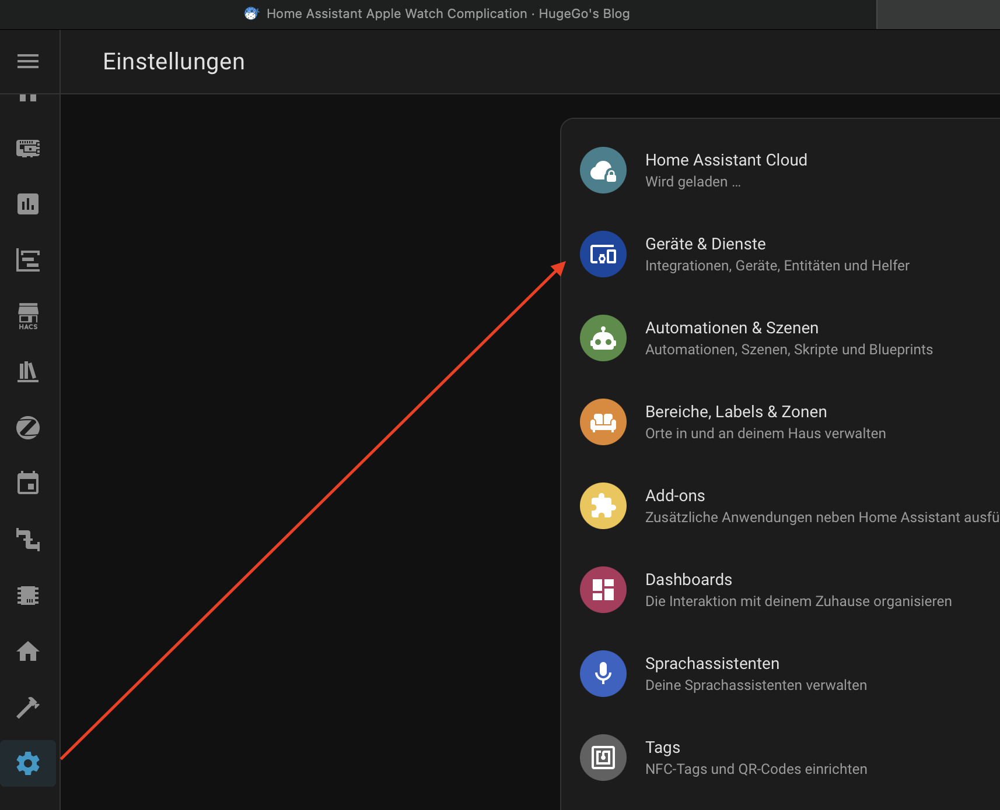
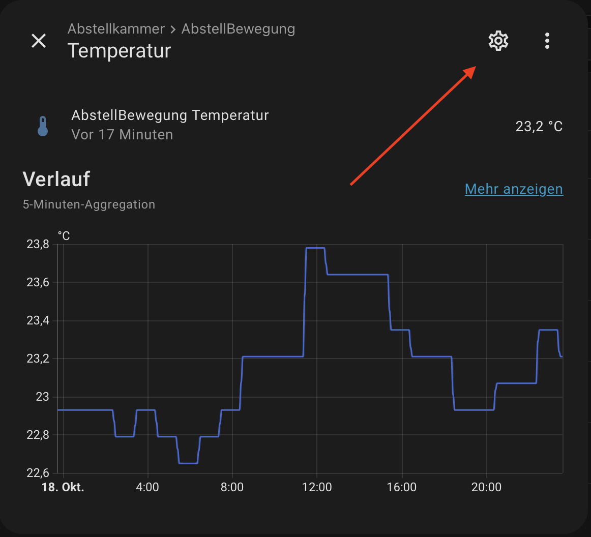
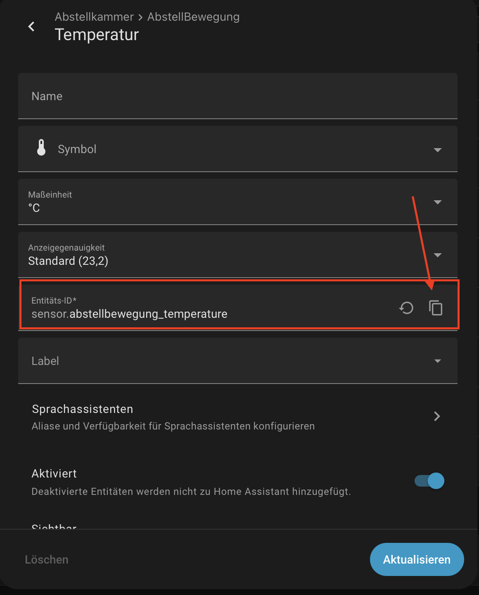
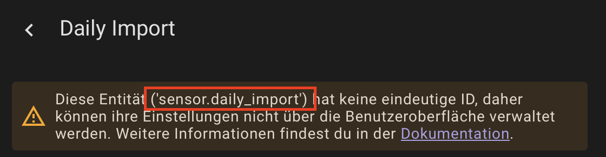
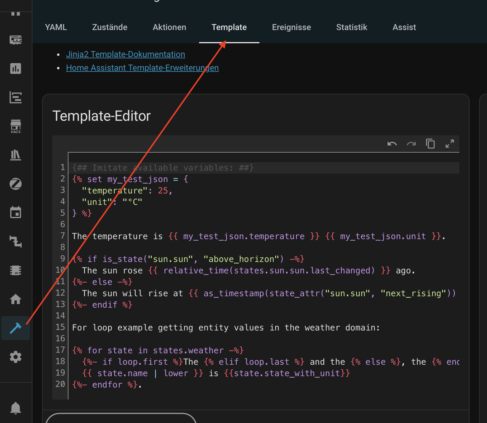
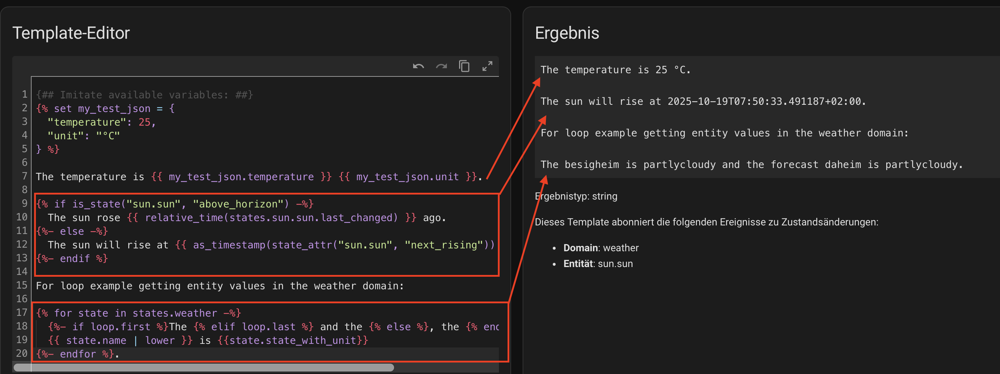
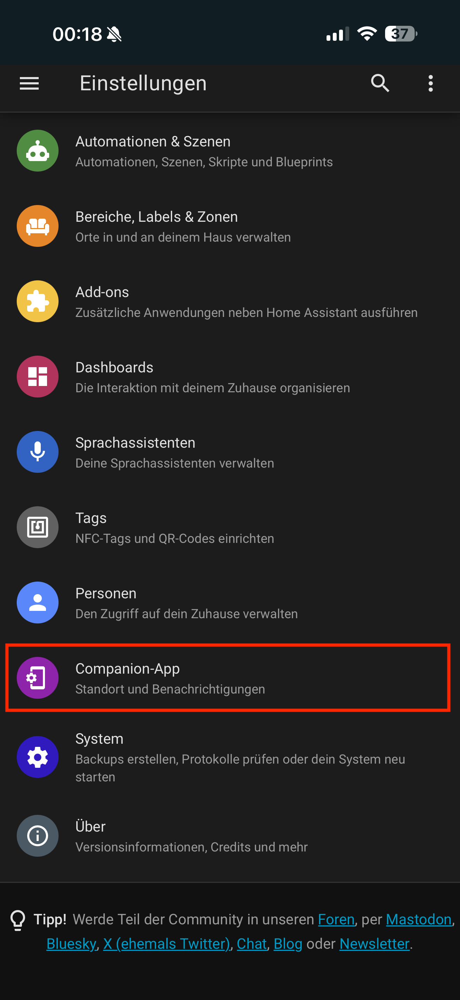
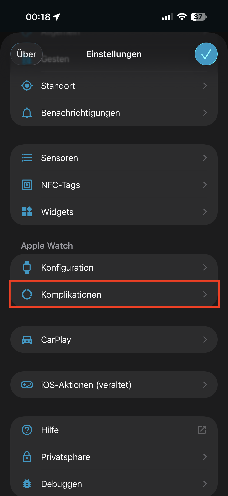
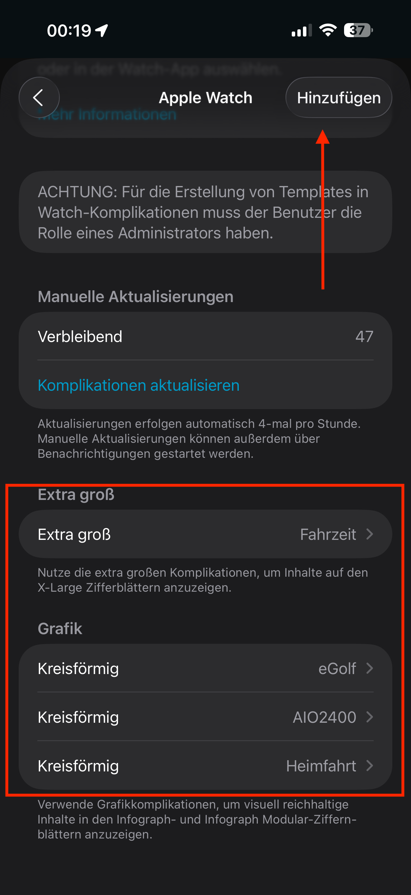
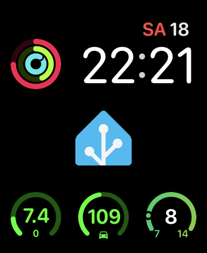

+++
date = '2025-10-18'
draft = false
tags = ['Apple Watch', 'Complication', 'Home Assistant', 'Anleitung']
title = 'Home Assistant Apple Watch Complication'
categories = ['Youtube']
+++

## Der Game-Changer

Ah, der neue eGolf hat eine App Anbindung, cool. Ah, da da gibt es auch ein Widget für iOS, mega. Wie für die Apple Watch gibt es keine Complication? Warum das denn? So oder so ähnlich geht es mir immer wieder mal. Ja cool wenn es für alles eine App gibt, cool wenn jemand sich die Mühe gemacht hat ein Widget für das iPhone zu schreiben. Leider hört es bei vielen Entwicklern da aber auf. Klar der Markt für Apple Watches ist deutlich niedriger und wie viele konfigurieren ihre Apple Watch schon. 

Gut, dass all diejenigen die Home Assistant am Laufen haben eine Möglichkeit haben ihre eigenen Complications zu schreiben. Ich habe so zum Beispiel für den Akku meines Balkonkraftwerks erstellt, oder eben für meinen eGolf eine Anzeige seiner Reichweite und den State of Charge. 

Ja die Funktion gibt es schon länger, aber ich glaube wenige wissen davon und noch weniger wissen wie man das machen kann. Deshalb gibt es jetzt hier eine kleine Anleitung dazu. Viel Spaß damit. 

## Anleitung

### Entity

Zuerst brauchen wir eine Entity die wir anzeigen wollen. Eine Liste alle Entitäten findet ihr ganz normal in eurem Home Assistant unter Entitäten. 

Wer schon weiß wie das geht, kann dieses Kapitel gerne überspringen. Ich denke ich erkläre hier keine Geheimnisse. 

Erst gehen wir in den Einstellungen auf die 'Geräte und Dienst'. 



Anschließend kann man zum Beispiel über den Entitäten Tab nach der entsprechenden Entität suchen die man in seiner Complication nachher anzeigen will. 


Hat man die Entität gefunden die man will, klickt man auf die selbige drauf um sich die Detailansicht anzuzeigen. 



Nun oben rechts auf das Zahnrat klicken. Dies öffnet die Einstellungen der Entität, hier kann man dann auch gleich die Entitäts-ID der Entität raus kopieren. 

Mit dem Icon kann man diesen Entitäts-ID einfach in die Zwischenablage kopieren.



**Analoganzeige** (sensor.sf_hub2000_battery_level ist der aktuelle SoC):


**Warning!** Wichtig ist die Entität nicht über die UI sondern über die YAML Datei erstellt und hat keine eineindeutige ID, so sieht das Einstellungsfenster anders aus. Siehe unten. 




### Template erstellen

Damit wir es uns ein wenig leichter machen, nutzen wir jetzt die herausgesuchte Entität und erstellen ersteinmal ein 'Template'. Dieses Template wird nachher das sein, was wir in der iOS App in die Home Assistant App kopieren werden. 

Zu finden ist dieser Template Editor hier.



Netterweise haben die Entwickler von Home Assistant uns diesen Editor schon mit ein paar Beispielen gefüllt. So sehen wir hier Beispiele für das einfach Einfügen eines Wertes, das benutzen von IF-Anweisungen und sogar Schleifen. Weiter finde ich diesen Editor einfach super, weil wir auch life das Ergebnis unserer Template sehen, siehe Bild unten. 



Hier ein einfaches Beispiel für das Durchreichen der Entitätswerte. 

```
The temperature is {{ my_test_json.temperature }} {{ my_test_json.unit }}.
```

Und hier das Beispiel für eine IF-Abfrage. 

```

  The sun rose {{ relative_time(states.sun.sun.last_changed) }} ago.

  The sun will rise at {{ as_timestamp(state_attr("sun.sun", "next_rising")) | timestamp_local }}.

```

### Home Assistant iOS App

In den Einstellungen der iOS App kann man nun in den Menüpunkt 'Companion-APP'


**Warning!** Wichtig der Punkt 'Companion-App' erscheint nur in der APP selber und taucht nicht auf wenn man über die Website.




Hier kann man nun die Komplikationen für die Apple Watch auswählen. 



In dem untenstehenden Bild sieht man nun ein paar Beispiele für erstellte Komplikationen.




**Warning!** Ich habe noch nicht ganz verstanden wann die Komplikationen auf die Apple Watch aktualisiert werden. Manche scheinen Sofort da zu sein, andere bekomme ich einfach nicht angezeigt.


## Beispiele 


### Unten links

**Type:** Grafik kreisförmig

**Template:** Offene Analoganzeige einfacher Text

**Mitte** (sensor.daily_import und sensor.daily_import ist die Einspeisung und der Netzbezug):

Da die Sensoren standardmäßig als String ausgegeben werden, caste ich hier die Strings erstmal in einen Float. Anschließend werden die beiden Float werte nochmal gerundet. Dadurch kann ich sicherstellen, dass die Werte auch 'klein bleiben'. Mache ich das nicht, kann es sein, dass die Float-Werte auch gerne mal 5-6 Nachkommastellen. Das passt natürlich nicht in die Anzeige rein. 

```
{{(states("sensor.daily_import")|float-states("sensor.daily_export")|float)|round(1)}}
```

**Unten** (sensor.sf_hub --> sind die Daten der Batterie, ob gerade eingespeist oder aus der Batterie Energie entnommen wird):

Hier hole ich mir den aktuellen Ladezustand des Akku. Wird er gerade geladen, so wir ein Plus unten angezeigt, beim Entladen ein Minus, wird gerade nicht geladen eine 0 und ist der Zustand unbekannt, so wird ein Fragezeichen angezeigt. 

Hier kann man auch schön sehen, dass man hier auch eine IF-Abfrage machen kann.

````

  0


  -


  +


  ?

````

**Analoganzeige** (sensor.sf_hub2000_battery_level ist der aktuelle SoC):


**Warning!** Die Werte müssen zwischen 0 und 1 liegen. Weshalb der SoC auch nochmal durch 100 geteilt werden muss. 


```
{{states("sensor.sf_hub2000_battery_level")|float/100}}
```

### Unten Mitte

**Type:** Grafik kreisförmig

**Template:** Offene Analoganzeige Bild

**Mitte:**

Restreichweite des eGolf. 

```
{{states("sensor.egolf_battery_cruising_range")}}
```

**Analoganzeige:**

```
{{states("sensor.egolf_battery_level")|float/100}}
```

**Symbol**:

Hier habe ich einfach eine passendes Symbol ausgewählt. 

## Youtube Short

Hier noch der Link meines Youtube Short Videos, dass ich vor einer Weile aufgenommen habe. 

