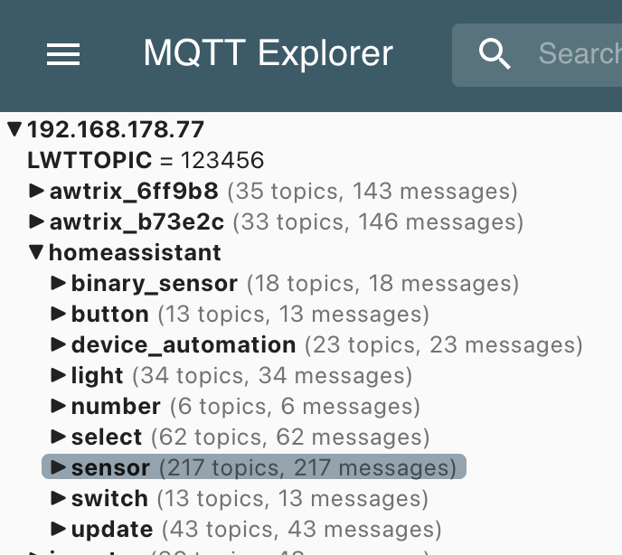

+++
date = '2025-10-28'
draft = false
tags = ['Home Assistant', 'Anleitung', 'EMQX', 'MQTT', 'Broker']
title = 'EMQX in Home Assistant einbinden und konfigurieren'
categories = ['Blog']
+++

## Einleitung

Wer Zuhause eine Home Assistant Instanz am Laufen hat kommt irgendwann an den Punkt einen MQTT Broker zu installieren. Meist ist das Mittel der Wahl 'Mosquitto'. Dieser ist super einfach zu konfigurieren und weil er so bekannt ist gibt es auch einige Videos auf Youtube wo man ihn einfach einbinden kann. Auch ich habe 'Mosquitto' lange verwendet, doch an dem Punkt als ich einen Teilnehmer ohne Nutzer und Passwort einbinden wollte war ich dazu genötigt mich nach einer Alternative umzuschauen. Mosquitto wird seit einigen Versionen nur noch so ausgeliefert, dass zumindest ein Nutzer und Passwort gesetzt werden muss. 

Auf der Suche bin ich auf EMQX aufmerksam geworden. Auch hier gibt es mittlerweile einige Anleitungen und Videos, jedoch gab es hier und da einige Kniffe die ich hier kurz beschreiben will. Den das Installieren ist eine Sache, das stabil ans Laufen bringen eine andere. 

Aus der Not geboren habe ich EMQX installiert und jetzt eine Weile am Laufen und bin soweit ganz zufrieden. Wer ein Diagramm Nerd ist, so wie ich, der wird auch seine Freude haben an dem User Interface.

## Installation

Wie so viele Addons kann auch EMQX einfach via HACS installiert werden. Das entsprechende Repository findet man [hier.](https://github.com/hassio-addons/addon-emqx)

## Browsen mit dem MQTT Explorer

Der [MQTT Explorer](https://mqtt-explorer.com) ist ein nützliches Werkzeug zum überprüfen welche Daten über den Broker gehen. Damit der MQTT Explorer die Daten auf dem Broker auch anzeigen kann, muss dieser in den Settings den Status des Brokers auch übermitteln. Macht man das nicht, zeigt der MQTT Explorer beim verbinden mit dem Broker nichts an. Ich für meinen Teil habe es nicht hinbekommen. Der einzige Weg war, den Broker jedes mal neu zu starten, das war für mich natürlich keine Option. 

[Sys in MQTT Explorer](images/sys.png "Der Sys-Knoten des Brokers im MQTT Explorer")

## Retain Daten auf Disc speichern

Retain Daten sind gerade für die Home Assistant Auto Discovery wichtig. Beispiel AhoyDTU, hier kann man die Daten via MQTT publishen. Damit man nicht alles händisch konfigurieren muss, kann man ganz einfach die MQTT Daten via MQTT Konfigurieren. 

Wichtig ist jetzt EMQX so einzustellen, dass diese Daten auch gespeichert werden. Das Retain Flag sieht man in dem Bild oben. Mit den standard Einstellungen werden diese Retain Daten aber nur im RAM gespeichert. Heißt, mit jedem Neustart sind diese Daten weg. Das hat sich bei mir darin gezeigt, dass nach dem Neustart keine Daten mehr für Home Assistant zur Verfügung standen. 

Will man nun sicherstellen, dass diese Daten auch nach einem Neustart noch von Home Assistant geladen werden können, so müssen diese auf der 'Platte' gespeichert werden.

[Retain](images/retain.png "Retain-Daten auf der Disc speichern")