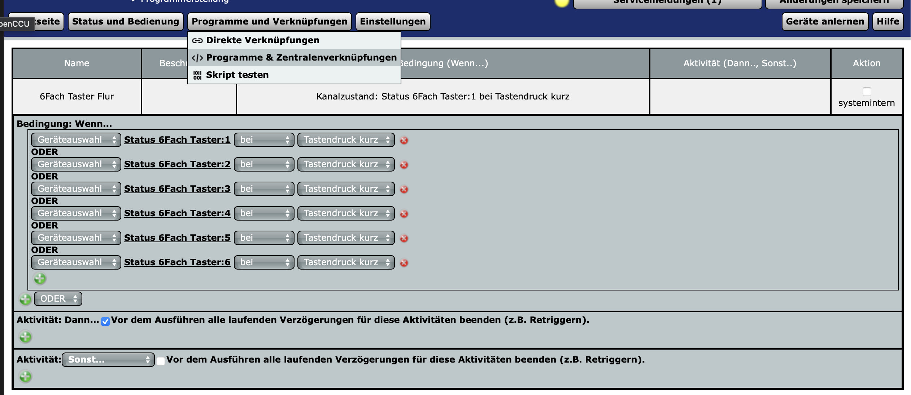
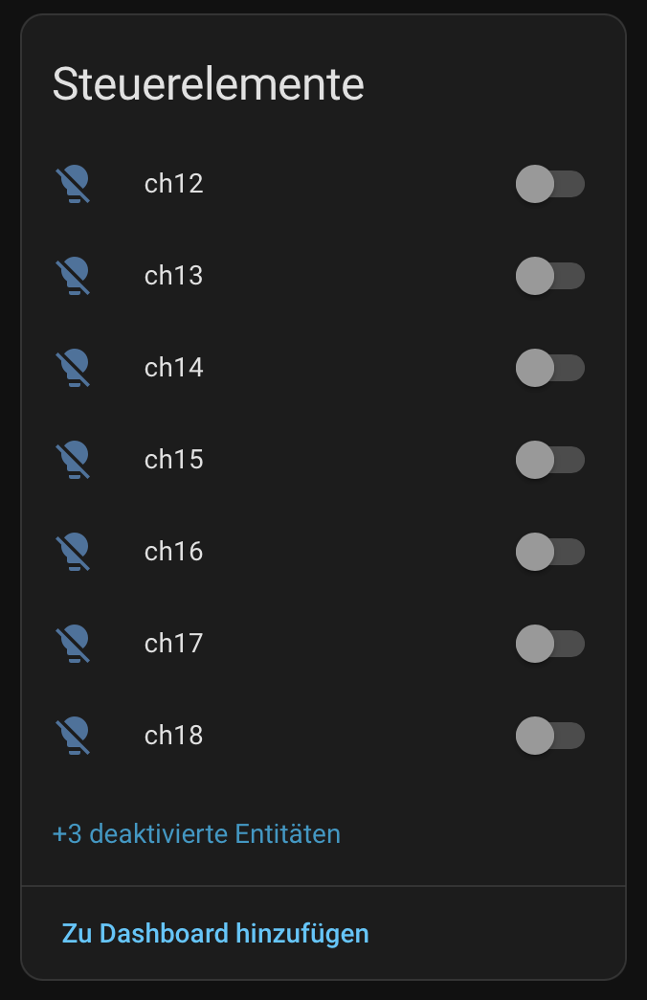
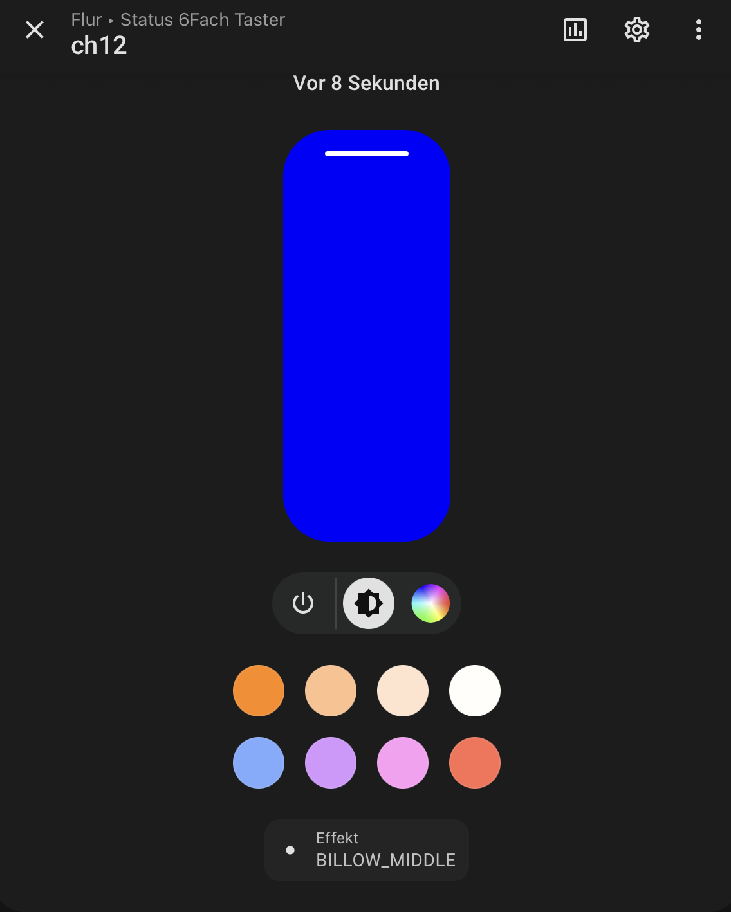
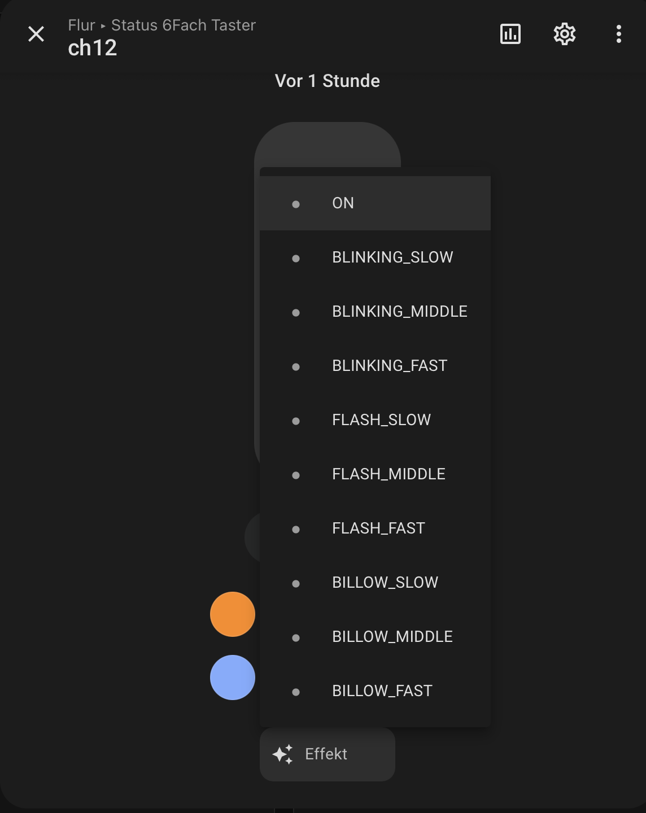
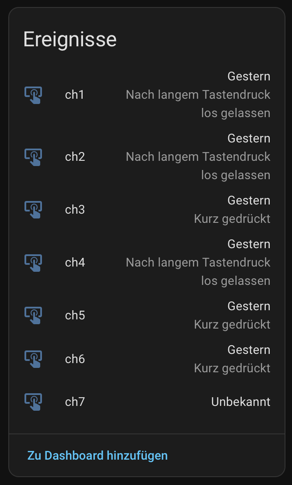
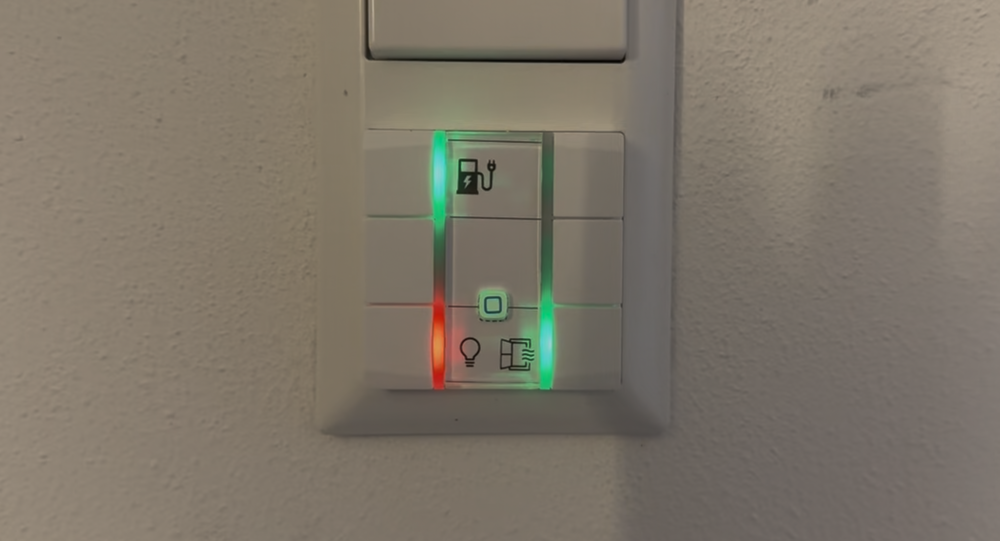

+++
date = '2026-02-01'
draft = false
tags = ['Home Assistant', 'Homematic', 'HmIP-WRC6-230', 'Erster Eindruck', 'Braucht kein Mensch, muss ich haben']
title = 'Erster eindruck HmIP-WRC6-230'
categories = ['Youtube']
+++

## Man hab ich da lange drauf gewartet

Seit Homematic die Schaltgruppe HmIPW-WRC6 raus gebracht hatte fand ich das ein sehr spannendes Produkt, einziger Nachteil. Die Schaltgruppe funktioniert leider nur mit Homematic IP Wired. Damit war das Thema für leider sehr schnell erledigt. Nirgends habe ich Homematic IP Wired verbaut und da ich auch keine Kabel in der Wohnung verlegen wollte war das für mich ein K.O. Kriterium. Und so musst ich auf den kleinen Bruder ohne LEDs ausweichen, der einzige Vorteil hier, der war Batteriebetrieben, was den Vorteil hat, dass man ihn überall anbringen kann.  
Anscheinend war ich wohl nicht der einzige der der Meinung war, dass diese Schaltgruppe für Homematic IP (ohne Wired) gemacht gehört. Letzte Woche war es dann soweit, es gab eine Pressemitteilung, dass die Schaltgruppe nun auch nur über Funk (Homematic IP) zu haben ist.  
Ein klarer Fall für die Kategorie 'Braucht kein Mensch, muss ich haben'. Also in den Warenkorb gelegt, gewartet, angeschlossen und ausprobiert.

## Mein Setup

Ich verwende Seit Anfang des Jahres OpenCCU, ein Opensource Projekt, welches mithilfe des Homematic USB Sticks eine ganze CCU emulieren kann. Das Ganze lebt als Addon/App in meinem Home Assistant. (ich muss sagen, OpenCCU läuft auf meiner Ugreen NAS mit Proxmox soviel besser und schneller wie meine alte CCU2, dass ich mich frage warum ich nicht früher umgestiegen bin).  
Warum erwähne ich das, kurz bevor die HmIP-WRC6-230 Schaltgruppe bei mir daheim eingetroffen ist, gab es ein offizielles Release von OpenCCU in dem diese Schaltgruppe nun unterstützt wird. Wie das mit der CCU2 oder 3 aussieht kann ich nicht sagen. Aber ich schätze mal die werden auch ein Release hierfür bekommen haben. 

## Einbindung

Nach der Installation im Flur habe ich wie immer den Einrichtungstanz der Homematic Komponenten getanzt. Um ehrlich zu sein, entweder stelle ich mich da immer dumm an, oder es ist echt jedes mal ein gefrickel. In jedem Fall hat es für meinen Fall mal wieder zu lange gedauert, bis der Taster erkannt wurde. Sei es drum, ich habe den Taster am Ende in meine OpenCCU rein bekommen. Und wie es sich gehört, wurde dieser dann über meine Homematic IP Integration von Home Assistant auch gleich erkannt.  
Die LEDs waren sofort schaltbar, Farben konnten geändert werden und auch die Effekte, blinken oder billow (ein Pulsieren) der LEDs konnte in verschiedenen Geschwindigkeiten eingestellt werden. Super, genau deshalb wollte ich die Kiste ja.  
Das Auslesen der Tasten war wie immer ein wenig ein gefrickel. Man muss wie auch bei anderen Tastern ein Programm einlernen welches die Tasten ausliest. Das Programm in der CCU muss an sich nichts machen, aber es müssen die Taster eben hinterlegt sein. Ich habe dafür bei mir einfach immer gesagt, dass ich einen kurzen Tastendruck auslesen will, mehr braucht es nicht. In Home Asssistant wird dann nachher immer noch schon differenziert ob es sich um einen kurzen oder langen Tastendruck handelt. 


  
  
  
  


## Der erste Schuss

Wie immer bei diesen 'Boa geil, das muss ich haben'-Aktionen suche ich jetzt nachträglich noch nach einem guten Einsatzzweck für diesen Schalter. Meine ersten Ideen waren. Status der Wallbox anzeigen, Status der Lichter, welche nicht automatisch ausgehen und der Status der Fenster.  
Das Ergebnis kann man hier im Bild sehen. Wobei ich beim Laden des E-Autos die LED pulsieren lasse. Ist die Wallbox an, lädt aber nicht leuchtet die LED einfach grün und wenn die Wallbox aus ist, dann ist die LED eben rot. Sind irgendwo noch Fenster offen dann leuchtet die LED rot und so weiter. Ja bei den Fenster bringt mir die Taste aktuell nichts, aber vielleicht stelle ich bei uns in den Flur noch einen Lautsprecher der mir dann später über Text-To-Speech dann noch sagen kann welche Fenster noch offen sind, nachdem ich den Knopf gedrückt habe. Aber ihr sehr, es gibt noch Knöpfe die danach schreien belegt zu werden. 

## Youtube

Wird demnächst noch erscheinen