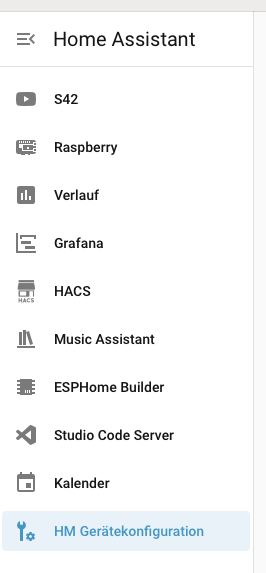
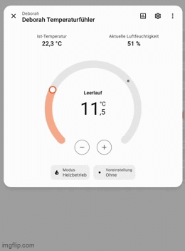
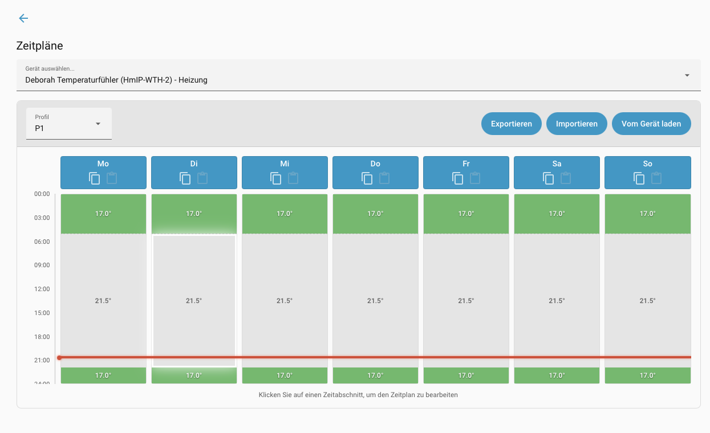
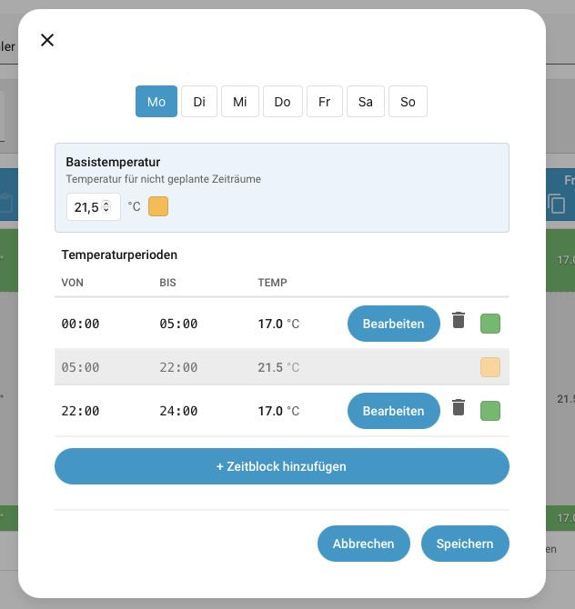

+++
date = '2026-05-05'
draft = false
tags = ['Home Assistant', 'Homematic', 'Homematic(IP) Local for OpenCCU', 'Thermostat', 'Ausschalten']
title = 'Endlich ausgeschaltet'
categories = ['Youtube']
+++

Home Assistant und die Homematic ...  
wird immer besser und jetzt habe ich auch meinen Frieden mit den Thermostaten.  
Seit ich mit dem Thema Smart Home angefangen habe, nutze ich auch Komponenten von Homematic. Sicherlich ist nicht alles perfekt mit diesen Komponenten und an manchen stellen wirken sie vielleicht auch ein wenig altbacken, aber im großen und ganzen tun sie ihren Dienst. Meine ersten Schritte waren aber nicht in Verbindung mit Home Assistant sondern mit openHAB. Die Integration von Homematic in openHAB empfand ich damals als sehr rund. Es war dementsprechend ein wenig hard für mich zu sehen, dass die Integration in Home Assistant, zumindest am Anfang, nicht ganz das bieten konnte was ich aus openHAB gewöhnt war. Was genau die Punkte zu dieser Zeit waren kann ich schon gar nicht mehr recht benennen, das ist auch nicht schlimm, denn mittlerweile vermisse ich definitiv nichts mehr, im Gegenteil.  

Lange hatte ich noch gehadert, weil ich es z.B. nicht hinbekommen habe die Thermostate "auszuschalten". Egal welche Temperaturen ich einstellte, welche Buttons ich auf der Oberfläche drückte oder aber auch welche Services ich ansteuerte, das Ergebnis war immer das selbe. Der Thermostat stand kurze auf aus, nur um dann Sekunden später wieder auf an zu springen. Zwar war der Thermostat dann auf 5 Grad eingestellt, aber er wurde eben nicht als aus im Home Assistant gekennzeichnet. Das brachte meinen inneren Monk so sehr auf die Palme, dass ich die Thermostate einfach immer angelassen hatte und auch die Wochenpläne nicht Homematic anvertraute sondern lieber selber in Home Assistant nach programmierte.  
Das hat sich nun aber mit einem der letzten Updates von Homeatic(IP) Local for OpenCCU grundlegend geändert. Seit einer weile nun wird standardmäßig in der Seitenleiste diese Integration default mäßig angezeigt. Man muss sie also ganz bewusst aus der Seitenleiste werfen. Wenn ich die Changelogs richtig gelesen habe, haben die Entwickler diesen Schritt gemacht, damit Nutzer dieser Integration überhaupt auf dieses Menü stoßen. Ganz ehrlich, ich war einer dieser Nutzer der diese Integration was weiß ich wie lange schon nutze, aber noch nie in die Seitenleiste reingeschaut hatte. Ich bin den Entwicklern also ganz schön dankbar für diesen Schritt. So sehr, dass es eben heute einen Blogpost hierfür gibt. 

## Das neue Seitenleisten-Element

HM Gerätekonfiguration, so nenne sich der neue Eintrag in der Seitenleiste. Erst wusste ich nicht einmal wo der her kam, hatte ich die Integration doch schon eine ganze weile installiert und bisher nie diese Seitenleiste gesehen. Natürlich hatte der neue Eintrag meine Neugier geweckt und ich musste erst ersteinmal explorieren was sich denn nun hinter diesem neuen Eintrag verbirgt.  
Ein Hub und viele Geräte, mein erste Eindruck war nüchtern. Okay eine Aufzählung alles Homematic Geräte gab es doch auch schon an anderer Stelle

Erst der zweite Blick lies mich ein wenig erahnen welche Möglichkeiten sich in diesem Menü auftaten. Denn mit dem Klick auf ein beliebiges Gerät kommt man eben nicht in die Liste der Entitäten, sondern wirklich, wie es die Seitenleiste schon andeutet, in die Konfiguration der einzelnen Geräte. Hier begrüßen einen auf einen Schlag schaltflächen wie Zeitpläne, Änderungsverlauf oder aber auch Direktverknüpfungen. Sollte dies die Lösung für die in die Jahre gekommene Konfigurationsseite der CCU2 sein? 

### Thermostat Minimum setzen

'MASTER konfigurieren' klang schon mal sehr viel versprechend, im zweiten Eintrag dann die Überraschung. Meine Thermostate waren durch die Bank auf eine minimal Temperatur von 5 Grad eingestellt. Unter dem Label stand aber, dass das Minimum bis runter auf 4,5 Grad Celsius gehen kann. Der Slider ging zwar nicht soweit runter, aber in dem Textfeld konnte ich dann einfach die 4,5 eingeben. Meine Thermostate nicht auf das absolute Minimum eingestellt waren war mir bis dahin nicht bewusst. 

Weiter bin ich mir nichtmal sicher, ob es innerhalb der CCU überhaupt einen Wert gab, anhand dessen ich sehen und ablesen konnte was das Minimum für die Temperatur ist.  
Lange Rede, kurzer Sinn, ich habe darauf hin nochmals den Test gemacht gehabt mir den Thermostaten und dem Ausschalten über den Knopf in der UI und siehe da, die Thermostate bleiben nun auch wirklich ausgeschaltet. 

### Zeitpläne einstellen

Nachdem ich also schon die ersten Vorteile dieser neuen und deutlich besseren UI verglichen mit der CCU gefunden hatte, wollte ich nun auch wissen wie aufwendig es ist einen Wochenplan zu konfigurieren und für alle Teilnehmer zu übernehmen.  
Im oberen Drop Down konnte man nun den Thermostat anwählen welchen man konfigurieren wollte. Anschließend das Profil ausgewählt, ich habe einfach P1 stehen lassen. Mit einem Klick auf den Wochentag bekomme ich nun einen Dialog angezeigt. Dieser ermöglicht es mir mehrere Zeitfenster, sowie die Dauer und Temperatur einzustellen. Bin ich mit meiner Einstellung zufrieden speichere ich diese ab. Unterhalb der einzelnen Tagesnamen kann ich nun mithilfe der Copy&Past Buttons einfach die Einstellung auf verschiedene Tage übertragen. Bin ich zufrieden sende ich meine neue Einstellung an das Gerät und fertig. Alles ohne in die UI von CCU gehen zu müssen. 

## Fazit

Für mich ist die plötzlich aufgetauchte Seitenleiste am Anfang verwirrend und vielleicht auch ein wenig nervig gewesen. "Jetzt will schon wieder jemand meine Aufmerksamkeit, das fehlt mir noch." Doch am Ende muss ich sagen ist es einfach wahnsinnig gut was die Entwickler:innen da abgeliefert haben und die Ansicht verdient es so prominent zumindest einmal initial angezeigt zu werden, damit auch möglich viele sich mal hineinbegeben und damit ihre eigenen Erfahrungen machen können.   
Weiter bin ich auch super froh, dass sich meine Thermostate nun endlich so verhalten wie ich mir das schon immer gewünscht habe, das wurde aber auch Zeit. Ein Punkt weniger den ich von openHAB schmerzhaft vermisst habe, im Gegenteil, ein gutes Beispiel dafür wie die Community aktiv daran arbeitet Home Assistant noch besser zu machen. 