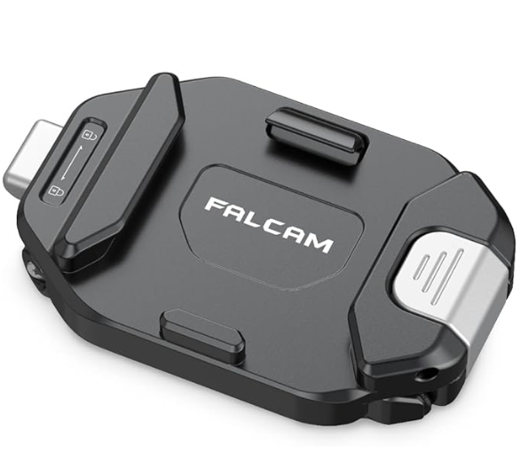
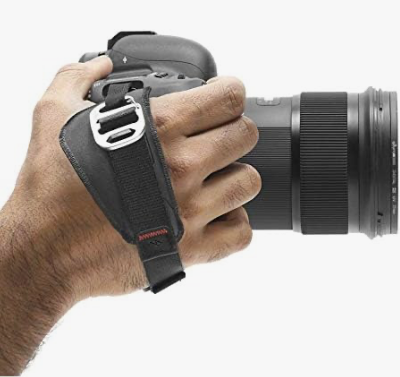
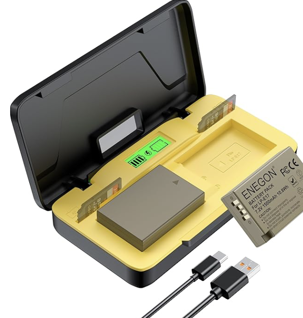

+++
date = '2026-06-21'
draft = true
tags = ['Foto', 'Falcom', 'Peakdesign']
title = 'Foto Reisebegleitung'
categories = ['Blog']
+++

Ich liebe es im Urlaub Fotos zu schießen, die Eindrücke in Bilder festzuhalten um mich dann nach dem Urlaub wieder an die schöne Zeit erinnern zu können. Da bin ich wohl nicht der Einzige. Doch seit nun zwei Jahren reisen wir eben nicht mehr zu zweit sondern zu dritt. Das hat alles ein wenig komplizierter gemacht, denn die neue Reisebegleitung hat wenig Lust zu warten, nochmal ein Foto hier, oder nochmal ein Foto da, das geht eben nicht mehr so leicht. Auch fällt mir die Nachbereitung meiner Aufnahmen schwerer, nicht weil der Workflow sich geändert hat, aber weil es als Familienvater dann doch auch immer ein langer Tag ist bis man in Ruhe die Fotos des Tages anschauen und Taggen kann.   
Deshalb habe ich mir vor einem Jahr mal ein wenig was gegönnt und ein paar neue Tools mit in den Reisekoffer geworfen. Hier eine kleine Übersicht über mein Reisekit für die Kamera und noch ein Ausblick für die Zukunft. 

## Falcom

Ich weiß nicht wie es euch geht, aber ich bin kein großer Fan von den mitgelieferten Halsgurten der meisten Kameras. Man bekommt Nacken, schnell mal die Kamera weitergeben ist auch nix und irgendwie ist die Kamera auch immer im weg, wenn man gerade keine Fotos schießt. Also habe ich mir schon Jahren eine Gurt gekauft der die Kamera dann seitlich hängen lässt und der auch den Nacken entspannt da man den Gurt Diagonal zum Körper trägt. Damit war ich eigentlich recht zufrieden. Aber mit Rucksack war es dann doch auch immer ein wenig stressig. Weshalb wir zu zweit im Urlaub immer einen hatten der die Kamera getragen hatte und einen anderen welcher den Rucksack mit der Verpflegung auf dem Rücken hatte.  
Warum war das auf einmal ein Problem? Weil wir Urlaub zu dritt planten und auf einmal gab es nicht nur einen Verpflegungsrucksack sondern auch noch eine Kraxe die getragen werden musst. Also ging ich auf die Suche nach einer Lösung für dieses Problem.   
Meine Lösung hieß [Falcom F38](https://amzn.to/4eZd6tW). Das ist ein Clip welcher am Träger des Rucksacks dran gemacht wird. 

## Peakdesign Handschlaufe

[Peak Design Handschlaufe](https://amzn.to/4vqdx6n)

## USB Akku Lader

[Canon USB Ladegerät](https://amzn.to/3Qgongf)

## Canon GPS Tagging

[Canon Camera Connect](https://www.canon.de/apps/canon-camera-connect/)

## Stativkopf